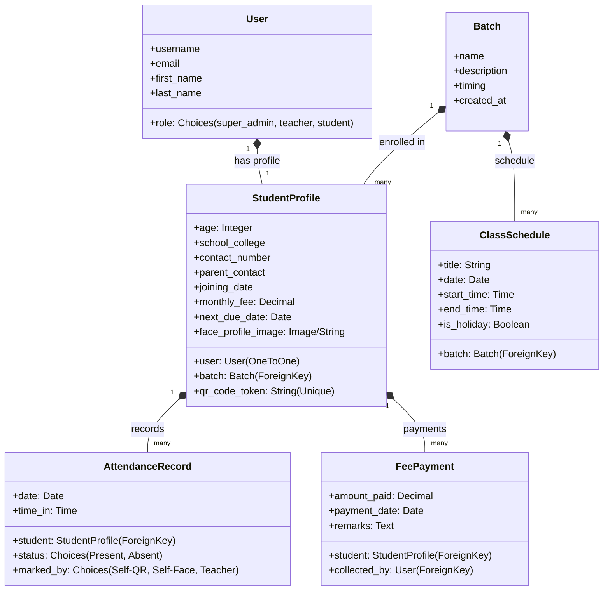

# Smart Coaching Center Management System - Implementation Plan

The proposed system is a Django-based web application designed to simplify student management, attendance tracking (using QR codes and facial verification), and fee administration for coaching centers.

## User Review Required

> [!IMPORTANT]
> - **Facial Verification Implementation**: To make this highly accessible and ensure high performance, we will implement facial verification primarily **client-side in the browser using the webcam, canvas API, and standard image analysis** (with an option for a mock-matching logic or a client-side JS library). This keeps the server lightweight and avoids complex server-side C++ compilation issues (like OpenCV or dlib on Windows).
> - **QR Code Generation and Scanning**: We will use client-side JS libraries like `qrcode.js` for generation and `html5-qrcode` for scanning via webcam. This provides a fast, mobile-friendly interface for both students (to show QR codes/scan) and teachers (to scan QR codes for attendance or fee collection).

---

## Open Questions

- None at the moment. The requirements are detailed and clean.

---

## Proposed Changes

We will create a Django project named `coaching_center` containing an app named `coaching`.

### Database Architecture and Models

---

### Dashboard Interfaces and RBAC

We will enforce role-based access control (RBAC) at the view level:
1. **Super Admin**: Full CRUD for batches, teachers, view-all dashboards, settings.
2. **Teacher**: Register students, update profiles, view calendar, check attendance, collect fees, see analytics.
3. **Student**: View personal attendance log, show/download QR code, mark self-attendance via webcam/QR, view basic profile. No fee information is exposed to students.

---

### Component-wise File Structure

#### [NEW] [settings.py](file:///c:/Users/Maria%20Kevin/OneDrive/Desktop/anthony/coaching_center/settings.py)
Standard Django settings configured to use custom user model (`coaching.User`), static assets, and media directories.

#### [NEW] [models.py](file:///c:/Users/Maria%20Kevin/OneDrive/Desktop/anthony/coaching/models.py)
Defines the `User`, `Batch`, `StudentProfile`, `AttendanceRecord`, `FeePayment`, and `ClassSchedule` Django models.

#### [NEW] [views.py](file:///c:/Users/Maria%20Kevin/OneDrive/Desktop/anthony/coaching/views.py)
Implements dashboards, authorization decorators, AJAX endpoints for the QR scanner, CRUD operations, calendar schedules, and authentication logic.

#### [NEW] [urls.py](file:///c:/Users/Maria%20Kevin/OneDrive/Desktop/anthony/coaching/urls.py)
Routing patterns matching all dashboards, actions, and API endpoints.

#### [NEW] templates/ directories
We will build modern, dark/light premium layouts with styled forms, dynamic calendars, and canvas webcam integrations:
- `base.html`: Common container, glassmorphic layout, modern fonts, sidebar.
- `login.html`: Premium login form with dynamic background.
- `super_admin_dashboard.html`: Analytics, teacher CRUD list.
- `teacher_dashboard.html`: Main KPIs, calendar, attendance/fee scan triggers.
- `student_dashboard.html`: Secure profile info, self-scanner.
- `student_detail.html`: Full record view for teachers (payment history, attendance chart).
- `register_student.html`: Detailed validation form.
- `scanner_attendance.html`: Camera module for student check-ins.
- `scanner_fees.html`: Camera module for teacher fee processing.

---

## Verification Plan

### Automated Tests
We will write a Django test suite:
- `python manage_party_tests.py` testing auth restrictions (confirming students cannot view billing views).
- Attendance logic tests verifying that attendance cannot be duplicated on the same day.
- QR code token validation checks.

### Manual Verification
- Launch the application using `python manage.py runserver`.
- Create a Super Admin, a Teacher, and a Student.
- Test logins and dashboard layouts.
- Verify camera-based QR scanning and check-in workflows.
- Confirm that the student interface contains absolutely zero reference to fee amounts or payment logs.
